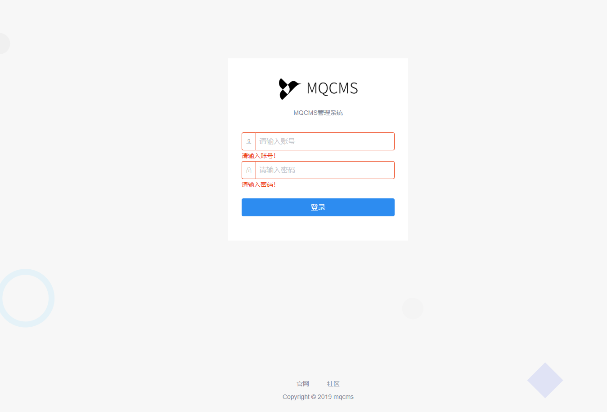
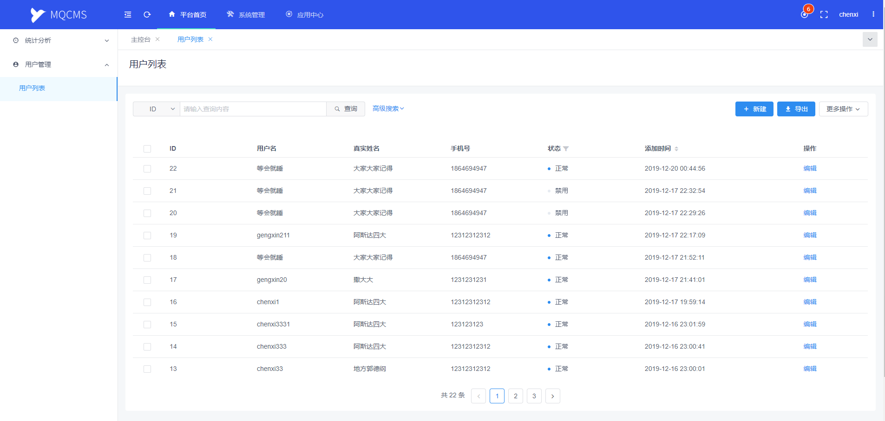
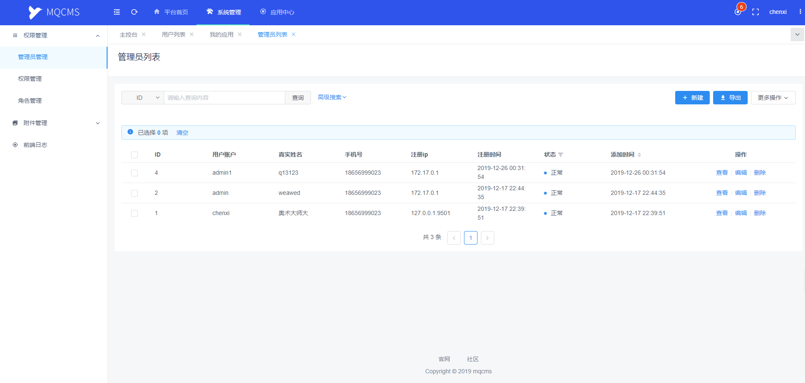
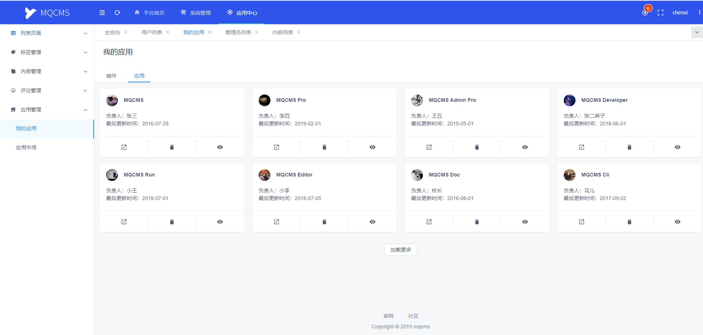

# MQCMS-admin
MQCMS是一款现代化，快速，高效，灵活，前后端分离，扩展性强的CMS系统。
MQCMS中的MQ取麻雀拼音首字母。寓意麻雀虽小五脏俱全，本项目使用iview vuejs组件搭建的后台系统模块。

后端项目：https://github.com/MQEnergy/MQCMS

### 应用截图
#### 1、登录页面

#### 2、平台首页

#### 3、系统管理

#### 4、应用中心


### 运行项目
#### Project setup
```
npm install
```

#### Compiles and hot-reloads for development
```
npm run serve
```

#### Compiles and minifies for production
```
npm run build
```

#### Lints and fixes files
```
npm run lint
```
